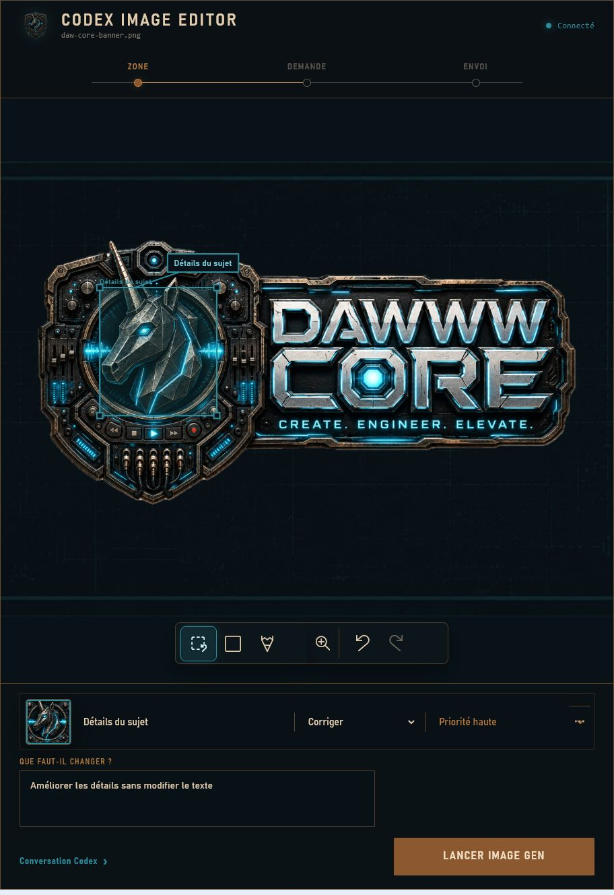
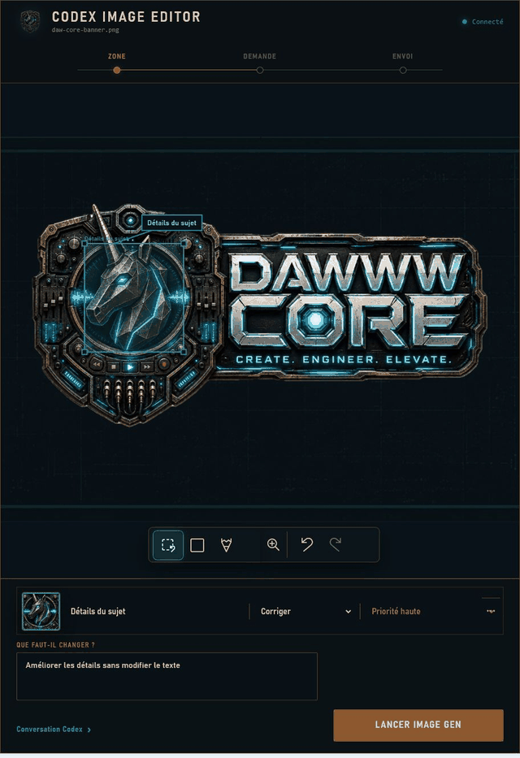

# Codex Image Editor

**MVP beta** — a focused, conversation-native workspace for editing any image with Codex native Image Gen.



The plugin turns an image-editing conversation into one clear flow: select a zone, describe the change, and send the prepared request to Codex. It is not limited to logos, and advanced tools stay out of the way until they are useful.

## Demo



The three primary states are:

1. **Zone** — mark the image with selection, rectangle, or brush; name the subject; choose the edit type and priority.
2. **Request** — confirm the change, add optional references, and refine advanced constraints only when needed.
3. **Send** — hand the exact request back to the current Codex conversation and review the real Image Gen result when it arrives.

The compact **Conversation Codex** drawer remains available for follow-up text without duplicating the main workflow.

## Native Image Gen Boundary

- No direct Images API calls.
- No API key, BYOK, fallback CLI, cloud backend, or external image service.
- No simulated generation result or fake progress in production.
- The MCP server stores local editor state, validates the request, prepares the handoff, and versions real artifacts.
- Image generation is performed only by Codex through native `image_gen` / `$imagegen`.

## Local Preview

Prerequisites: Git, Python, and Node `>=22 <25`.

```powershell
npm run test
npm run harness:widget -- --port 4318 --image "C:\path\to\image.png" --request "Improve the selected details"
```

Open `http://127.0.0.1:4318/`. The harness validates the widget experience and the `ui/message` handoff contract; it does not simulate an Image Gen artifact.

## Install Through The Personal Marketplace

Run the read-only preflight:

```powershell
npm run preflight:local-deploy
```

After the source commit is available on `origin/main`, deploy the committed revision:

```powershell
.\scripts\deploy-local.ps1 -Apply -InstallPlugin
```

The script creates or fast-forwards `%USERPROFILE%\plugins\codex-image-editor`, validates the bundle, adds a local-only cachebuster, atomically updates the `personal` marketplace entry, and writes a report under `%USERPROFILE%\.agents\plugins\reports\`.

See [Local Deployment](docs/LOCAL_DEPLOYMENT.md) for the complete desktop gate.

## Validation

```powershell
npm run privacy:check
npm run test
npm run check
npm run preflight:local-deploy
python <path-to-plugin-creator>\scripts\validate_plugin.py .
```

The automated suite checks:

- repository media and text for secret or personal-path patterns;
- the prohibition on direct image API or external network use;
- inline widget JavaScript syntax and the visual/interaction contract;
- standard MCP Apps resource metadata, tool calls, and `ui/message`;
- initial image/request hydration, zone persistence, native handoff creation, artifact-origin enforcement, version review, retry, and rejection flows.

The latest visual review is recorded in [design-qa.md](design-qa.md).

## Privacy

The committed documentation media is cropped to the plugin surface and contains no host chrome, absolute local path, credential, or image metadata. Runtime state is kept under `.codex-image-editor/` in the selected workspace and is ignored by Git. Do not publish private source images, prompts, generated artifacts, or workspace state.

See [Security Policy](SECURITY.md).

## Repository Layout

```text
.codex-plugin/plugin.json        Codex marketplace manifest
.mcp.json                        MCP server declaration
assets/                          DAWWWCORE brand and blueprint assets
docs/media/                      Sanitized repository captures and demo
mcp/server.mjs                   Local MCP state, validation, and handoff logic
mcp/image-editor-widget.html     Inline Zone / Request / Send workspace
scripts/                         Contract, privacy, smoke, and deployment checks
skills/image-editor/SKILL.md     Codex-native image editing workflow
```

## Live Host Gate

Local validation covers the widget, MCP contract, and native handoff. A production release still requires a real Codex desktop pass proving that native Image Gen returns an artifact to the workspace, that the artifact is registered with origin `codex-image-gen`, and that it can be accepted or rejected inline. If the host cannot return the artifact, the plugin must report `host_blocked`.

## License

This repository is public source-available but not open-source licensed. See [LICENSE](LICENSE).
