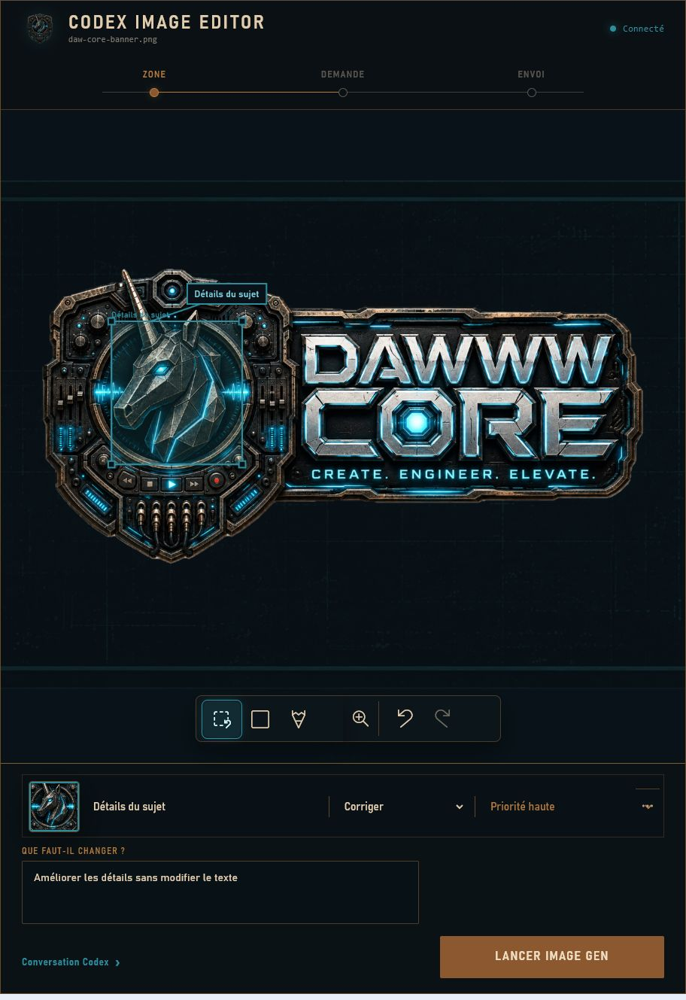
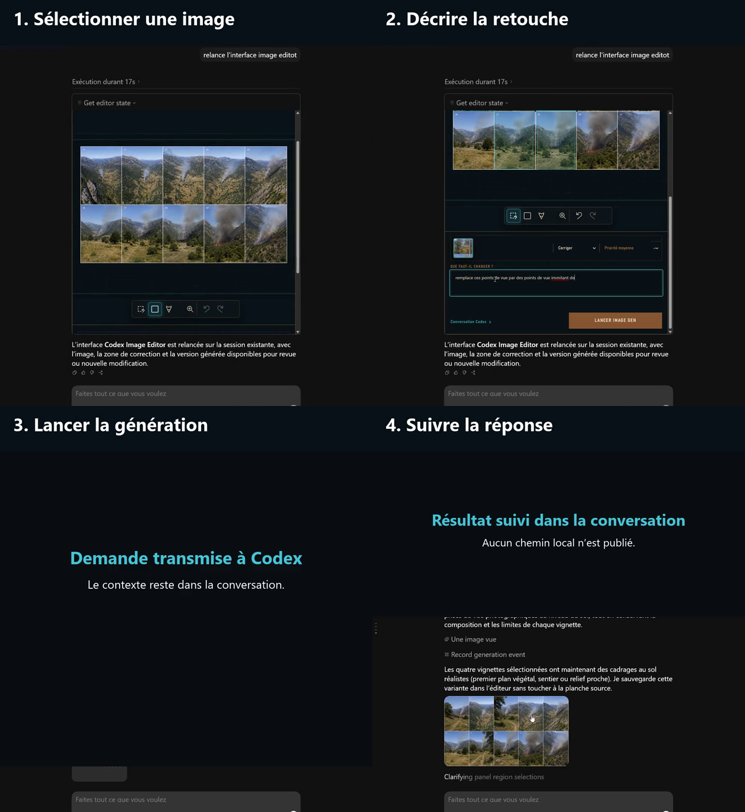

# Image Genial Codex Picture Editor

**v0.2.0-beta — MVP beta**

> Préparer et réviser des demandes de retouche précises, directement dans une conversation Codex.



Image Genial Codex Picture Editor transforme une demande de retouche en un parcours clair : sélectionner une zone, décrire le changement, puis remettre la demande structurée à Codex. L’éditeur fonctionne avec tout type d’image et garde les contrôles avancés hors du chemin principal tant qu’ils ne sont pas nécessaires.

## Preuves du parcours



Cette planche provient d’un parcours Codex desktop enregistré. Elle montre les quatre étapes réellement visibles : sélection de l’image, description de la retouche, remise de la demande et suivi de la réponse. La capture publique est recadrée sur la conversation et l’éditeur ; le nom de compte, les projets, les chemins locaux et les terminaux ont été retirés.

[Regarder la démo courte (27 s)](docs/media/codex-image-editor-demo-courte.mp4)

La démo ne fabrique ni résultat ni progression. Les passages susceptibles d’exposer un chemin local ont été remplacés par une transition éditoriale explicite.

## Pourquoi ce projet

Une retouche d’image devient vite ambiguë : une région doit changer, une autre doit rester intacte, une référence doit être respectée et le résultat doit pouvoir être revu. Le plugin ajoute une étape d’édition structurée dans le fil Codex avant l’appel à Image Gen.

Le plugin est conversation-native : l’image, les contraintes, le handoff et la revue restent associés à la conversation. Il prépare le contexte pour Codex ; il ne remplace jamais le moteur Image Gen natif.

## Parcours principal

1. **Zone** — sélectionner, encadrer ou peindre la région concernée, puis préciser le sujet, le type de correction et la priorité.
2. **Demande** — décrire le changement, ajouter éventuellement des références et ouvrir les réglages de précision seulement si nécessaire.
3. **Envoi** — remettre la demande exacte à la conversation Codex et attendre le vrai résultat Image Gen.
4. **Revue** — enregistrer uniquement un artefact dont l’origine est `codex-image-gen`, puis l’accepter, le refuser ou préparer une relance plus étroite.

Le tiroir **Conversation Codex** reste disponible pour les compléments sans dupliquer l’action principale.

## Capacités

- Canvas d’annotation avec sélection, pinceau, lasso, polygone, rectangle, ellipse, gomme, déplacement et zoom.
- Calques de correction, protection, erreur et référence.
- Zones `include`, `exclude` et `protect` avec validation, marge de sécurité, feathering, grille et snap.
- Request Builder pour les consignes, rôles d’images, contraintes et export `$imagegen`.
- Handoff natif par MCP Apps `ui/message`.
- Artifact Bridge pour l’origine, les candidats, l’acceptation, le refus et les versions.
- Revue avant/après, diagnostic des zones protégées et préparation d’une relance.

## Frontière Image Gen native

- Aucun appel direct à une Images API.
- Aucune clé API, BYOK, CLI de secours, API d’image externe ou backend cloud.
- Aucun résultat de génération ou état de progression simulé en production.
- Le serveur MCP conserve l’état local, valide la demande, prépare le handoff et versionne les artefacts réels.
- La génération est exécutée uniquement par Codex via le chemin natif `image_gen` / `$imagegen`.

## Aperçu local

Prérequis : Git, Python et Node `>=22 <25`.

```powershell
npm run test
npm run harness:widget -- --port 4318 --image "C:\path\to\image.png" --request "Améliorer uniquement les détails sélectionnés"
```

Ouvrir `http://127.0.0.1:4318/`. Le harness vérifie l’expérience du widget et le contrat `ui/message` ; il ne simule pas un artefact Image Gen.

## Installation par le marketplace personnel

Lancer le préflight en lecture seule :

```powershell
npm run preflight:local-deploy
```

Une fois la révision publiée sur `origin/main`, déployer la révision commitée :

```powershell
.\scripts\deploy-local.ps1 -Apply -InstallPlugin
```

Le script synchronise le bundle, valide le plugin, ajoute un cachebuster local, met à jour atomiquement l’entrée du marketplace personnel et écrit un rapport dans `%USERPROFILE%\.agents\plugins\reports\`.

Voir [Déploiement local](docs/LOCAL_DEPLOYMENT.md) pour le gate desktop complet.

## Validation

```powershell
npm run privacy:check
npm run test
npm run check
npm run preflight:local-deploy
python <chemin-plugin-creator>\scripts\validate_plugin.py .
```

Au 26 juillet 2026, `npm run privacy:check`, `npm run test`, `npm run check` et le validateur officiel du manifeste sont passants. Les contrôles automatisés couvrent :

- les secrets et chemins personnels dans les textes comme dans les données binaires ;
- l’interdiction des API d’image directes et du réseau externe ;
- la syntaxe du widget, le contrat d’interaction et les ressources MCP Apps ;
- l’hydratation initiale, les zones, la persistance et le handoff natif ;
- l’origine des artefacts, la revue, le refus et la relance ;
- le manifeste et le préflight du déploiement local.

Le MP4 a aussi été décodé intégralement sans erreur. La preuve PNG a été inspectée sans profil incorporé, et les deux médias ont été revus visuellement après recadrage.

La preuve enregistrée confirme le rendu inline, la sélection, la demande, l’envoi et le suivi dans la conversation. Elle ne suffit pas à certifier l’enregistrement, puis l’acceptation d’un artefact par l’Artifact Bridge. Ce dernier passage reste le gate hôte avant toute revendication « production certifiée ».

Voir la [checklist de release](docs/PUBLIC_RELEASE.md), la [fiche marketplace](docs/MARKETPLACE.md) et la [revue design](design-qa.md).

## Confidentialité

Les médias commités sont recadrés sur la surface utile et ne contiennent ni chrome hôte privé, ni chemin absolu, ni credential, ni métadonnée d’image. L’état runtime est conservé dans `.codex-image-editor/` dans le workspace sélectionné et reste ignoré par Git.

Ne publiez pas les images sources privées, prompts, artefacts générés ou états de workspace. Voir la [politique de sécurité](SECURITY.md).

## Structure

```text
.codex-plugin/plugin.json        manifeste et page marketplace
.mcp.json                        déclaration du serveur MCP
assets/                          marque et preuve publique nettoyée
docs/media/                      captures et démos publiques nettoyées
mcp/server.mjs                   état, validation et handoff local
mcp/image-editor-widget.html     interface Zone / Demande / Envoi
scripts/                         contrats, confidentialité, smoke et déploiement
skills/image-editor/SKILL.md     workflow d’édition Codex native
```

## Licence

Le dépôt est public et source-available, mais n’est pas distribué sous une licence open source. Voir [LICENSE](LICENSE).
